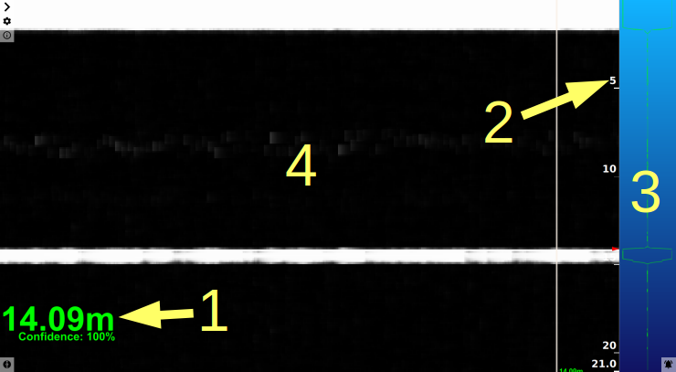

# Welcome to the Ping Viewer wiki!

## **This documentation is a work-in-progress. Content may not be accurate and is subject to change**

Ping Viewer is the graphical user interface for the Blue Robotics Ping Echosounder. This application allows you to connect, configure and view data from a Ping device.

# Quick Start

## Installing and Running the Application

- **Windows**

    Download [this .zip file](https://github.com/bluerobotics/ping-viewer/releases/download/t0.8.4/pingviewer_release.zip), open the download location in the File Explorer, and extract it. Open the application by double clicking the executable file (pingviewer.exe). Windows will ask you to trust the software; click **More Info** → **Run Anyway**.

  

- **Mac**

    Download [this .dmg file](https://github.com/bluerobotics/ping-viewer/releases/download/t0.8.4/pingviewer-release.dmg), and double click it to open. Drag the Ping Viewer application icon to your *Applications* folder. Open the application by double clicking the icon in your *Applications* folder.

    TODO check security settings
    TODO host images from local images folder

  

- Linux

    Download [this .AppImage file](https://github.com/bluerobotics/ping-viewer/releases/download/t0.8.4/pingviewer-x86_64.AppImage). Edit the permissions of the .AppImage to have _executable_ permission with the command line: `chmod +x ping-viewer-linux.AppImage`. Open the AppImage by double clicking it, or execute it from the command line: `./ping-viewer-linux.AppImage`.

> Remember to run the commands in the same path where the Appimage file is.

***

## Connection Setup

To begin using the device, connect it to a USB - UART converter that operates on 5V like [this](https://www.bluerobotics.com/store/comm-control-power/tether-interface/bluart-r1-rp/) Blue Robotics adapter. Then connect the converter to your computer's USB port. The Ping Viewer application should automatically detect your device and begin displaying data. If it does not, check the [FAQ and Troubleshooting](faq-and-troubleshooting) guide.

Visit the [Connection Settings](connection-settings) menu for more connection options.

***

## Principle of Operation

The Blue Robotics Ping Echosounder is a 1-dimensional sonar that measures the distance to objects underwater. The device emits a brief 115 kHz acoustic pulse from the transducer at the face of the device. The device then measures the strength of returned acoustic energy and the amount of time for the returned energy to reach a significant level. The sound wave travels through water, and reflects or 'echos' off of solid objects, and travels back to the device. The device then calculates the distance to the solid object with the equation `distance = known speed of sound in water * (measured time for echo to return / 2)`.

    

See the Wikipedia articles on [Echo sounding](https://en.wikipedia.org/wiki/Echo_sounding) and [Fishfinders](https://en.wikipedia.org/wiki/Fishfinder) for more information on how the device operates.

#### Target locking

The Ping device processes the data and attempts to lock on to the most likely target in view of the device. The algorithm for determining the target considers return strength (the strongest return is likely the target) and past measurements (ie. a low pass filter). The Ping device algorithm also produces a confidence measurement corresponding to the probability that it has correctly identified the target. In noisy environments presenting a lower signal-to-noise ratio, the confidence of the target lock may be reduced.

#### Distance and Profile Measurements

The device outputs the distance to the most likely target with the associated confidence. The device additionally outputs **Profile** samples, which consist of 200 signal strength measurements at regular distance intervals across the current scan range. These **Profile** samples provide a more detailed view of what might be in front of the Ping device. With the **Profile** data you can see fish in the water, determine if the device is picking up multiple reflections or interference from other acoustic devices, and possibly differentiate between eg. bare sand and plant life.

***

## Main Application Interface

The Ping Viewer window consists of four important components:
1. [Distance Readout](#distance-readout)
2. [Distance Axis](#distance-axis)
3. [Return Plot](#return-plot)
4. [Waterfall](#waterfall)

TODO use default color gradient

#### Distance Readout

The Distance Readout displays the distance to the target in the most recent measurement. This is the distance to the seafloor in [depth sounding](https://en.wikipedia.org/wiki/Depth_sounding) applications.

The confidence measurement for the most recent sample is displayed below the distance in the Distance readout. The color of the Distance Readout reflects the current confidence measurement, where red = 0% <-> green = 100%. // TODO better gradient explanation (picture)

The size of the distance readout can be [moved and adjusted](hotkeys-and-shortcuts#mouse-shortcuts).

#### Distance Axis

The Distance Axis is labeled with bold numbers on the right-hand edge of the Waterfall. This axis represents the distance from the Ping device transducer. The axis runs vertically down the screen, with the face of the transducer (zero distance) located at the top of the window. The deeper/farther an object is from the transducer, the closer its return will appear to the bottom of the window. The Distance Axis scale automatically adjusts to display the current scanning range of the Ping device.

There is an orange arrow on the Distance Axis indicating the distance to the target in the most recent measurement (this is the same as the Distance Readout).

#### Return Plot

The Return Plot displays the return strength vs distance of the most recent [**Profile**](#distance-and-profile-measurements) sample. The plot displays the measurement of only a single dependent variable (return strength), and is simply mirrored for ease of viewing. Stronger returns appear as wider traces.

**Note** You may observe a very strong return at the top of the screen (at zero distance, essentially touching the device); this return is from the Ping device itself. When the Ping device emits the acoustic pulse, the device is still vibrating or 'ringing' like a bell when it begins measuring the return signal. This residual energy in the vibrations of the Ping device body is picked up as a return signal until it decays away.

#### Waterfall

The Waterfall is a three dimensional plot that occupies the main portion of the application window. The Waterfall plots consecutive [**Profile**](#distance-and-profile-measurements) samples (distance running vertically and color indicating signal strength). The horizontal axis is time; new data is displayed on the right edge of the Waterfall as older data moves to the left.

The color scheme (gradient) of the Waterfall can be [customized](display-settings).

***

## Application and Device Settings

See [here](display-settings) for instructions to switch between meters and feet for the application display.

To adjust the update rate and other Ping device settings, visit the [device configuration](device-configuration) page.

***

## Interpreting Profile Data

As the sound wave travels through water, it may encounter several 'reflective' objects like fish, or air bubbles. These smaller objects will also produce a return signal as energy is reflected back to the device. The energy that returns from these smaller objects is usually much less than the energy reflected off of a larger solid object like the sea floor.

contrive/obtain examples. Reflections, fish
