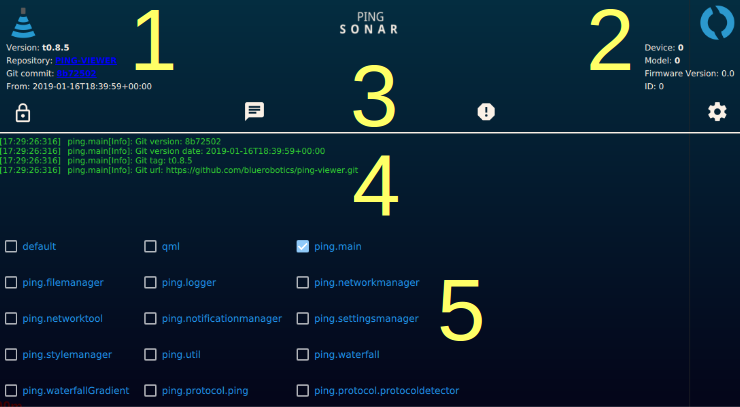

## Menu Items

1. [**Application software information**](#application-software-information)
2. [**Device model and firmware information**](#device-model-and-firmware-information)
3. [**Header buttons**](#header-buttons)
4. [**Application log**](#aplication-log)
5. [**Log categories**](#log-categories)

    

#### Application software information

This area shows information about the Ping Viewer application software version.

#### Device model and firmware information

This area shows information about the connected device.

#### Header buttons
-  Scroll lock for log window
-  [Blue Robotics Forum](https://discuss.bluerobotics.com)
-  [Bug reports and feature requests](https://github.com/bluerobotics/ping-viewer/issues)
-  Reset application settings

#### Application log

The application log area displays log messages emitted by the application. The log messages displayed in this window are filtered according to the log category selection (see below).

#### Log categories

Here, you can select which log categories to display in the application log area.

TODO describe log categories
