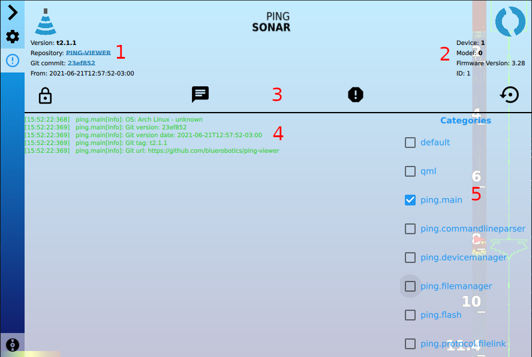

## Menu Items

1. [**Application software information**](#application-software-information)
2. [**Device model and firmware information**](#device-model-and-firmware-information)
3. [**Header buttons**](#header-buttons)
4. [**Application log**](#application-log)
5. [**Log categories**](#log-categories)

#### Application software information

This area shows information about the Ping Viewer application software version.

#### Device model and firmware information

This area shows information about the connected device.

#### Header buttons
-  Scroll lock for log window
-  [Blue Robotics Forum](https://discuss.bluerobotics.com)
-  [Bug reports and feature requests](https://github.com/bluerobotics/ping-viewer/issues)
-  Reset application settings

#### Application log

The application log area displays log messages emitted by the application. The log messages displayed in this window are filtered according to the log category selection.

#### Log categories

Here, you can select which log categories to display in the application log area. The log categories each coorespond to a source file or class. For example, the `ping.notificationmanager` category cooresponds to the [notificationmanager.cpp](https://github.com/bluerobotics/ping-viewer/blob/master/src/notification/notificationmanager.cpp) class. Enabling the log category will make the log events for the cooresponding source files visible in the debug log window. The log file that is written to disk always contains all log messages, the log category selection in the UI does not affect the log file.
