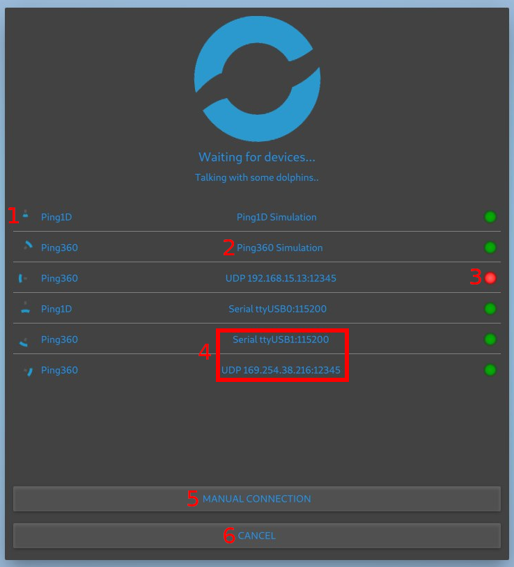
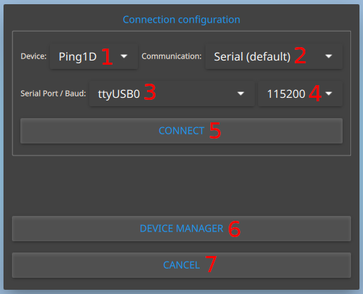

PingViewer automatically scans for available devices on serial ports (COM) and UDP connections. If a Ping device is detected, the available connection is shown and the user will be able to choose between all available devices in **Device Manager**.

PingViewer attempts to connect to UDP ports 9090 (*Ping1D* devices) and 9092 (*Ping360* devices) on the host at IP address `192.168.2.2`. This is the default IP address of the [onboard computer](https://blueos.cloud/docs/latest/integrations/hardware/required/onboard-computer) that runs on the BlueROV2. The onboard computer automatically configures a communication bridge on these ports to a connected sensor.

#### Device Manager

1. Shows an animation and the name of the available sensor.
1. Describes the kind of the available connection.
1. Shows the availability of the connection.
 **Red**: The connection is not available/reliable.
 **Green**: The sensor is connected and available for connection.
1. Describes the connection type and the connection configuration.
1. Allows the user to go to **Manual Connection**.
1. Cancel and exit **Device Manager**.
1. Opens **Ping360 Ethernet Configuration** painel.

#### Manual Connection

1. Displays all devices compatible.
1. Shows available connection types.
1. Lists all available serial ports.
1. Displays the valid baud rates for the selected device.
> Note: If the device uses **Automatic Baud Rate detection**, the baud rate list will not appear.
1. Connects with the configured settings.
1. Goes back to **Device Manager** menu.
1. Cancel and exit **Manual Connection**.

## Connection Types

- **Serial:** Select the serial port (eg. `COM1` or `ttyUSB0`) and baudrate, that will be updated by the possible baud rates for the sensor.
- **UDP:** Select the host UDP server IP address and port.

> Note: To connect the application to a Ping device on a remote host (eg. a Raspberry Pi) you can use the pingproxy program in the bluerobotics-ping python package:
>
> `pip install --user bluerobotics-ping`
>
> `python -m brping/pingproxy --device <device>`
>
> `<device>` is the serial port where the Ping device is connected (eg. `/dev/ttyUSB0`).

#### Ping360 Ethernet Configuration

Allows ethernet mode type as _DHCP Client_ or _static IP_. When using _static IP_, be sure to set an IP address that exists under your configured subnet.

> This configuration is only for users that have a custom network environment, such option is not supported fully.
