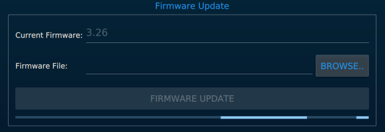
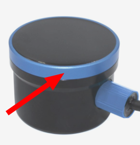
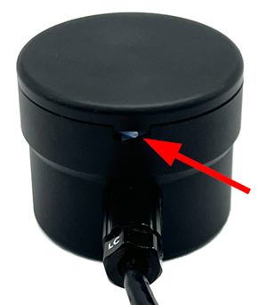

The Firmware Update menu allows you to update the programming on a Ping device.

## Automatic Firmware Update

Steps to flash the device:

1. [Connect](device-manager.md) to the device
2. Open the Firmware Update menu
3. Choose 'Automatic Update', and the latest available firmware version*
4. Click _FIRMWARE UPDATE_ to start the process.
5. The update progress is indicated by the progress bar located at the bottom of the menu. When the update completes, the progress bar will resume it's idle animation, and the Ping device will resume data transmission.

> Wait for the update process to complete before unplugging the device!

> *Firmware versions before v3.28 only communicate at a fixed baudrate, so require specifying the desired rate for your application (115kbps or 9600bps). Newer firmwares determine the baudrate automatically.


## Manual Firmware Update

Steps to flash the device:

1. [Connect](device-manager.md) to the device
2. Open the Firmware Update menu
3. Choose 'Manual Update'
4. Download your desired firmware from the `/ping1d` folder inside the [firmware repository](https://github.com/bluerobotics/ping-firmware/tree/master/ping1d)
    1. Right click 'Raw' and click 'Save Link As...' to save the firmware hex file (`.hex`)
    
    2. If the file format is coming up as 'Text Document (.txt)' or similar, change it to 'HEX File (.hex)' if possible, or select 'All files' and ensure the file extension is `.hex`, not `.hex.txt`
5. In Ping-Viewer, click `Browse` to select the firmware hex file that you saved
6. Click _FIRMWARE UPDATE_ to start the process.
7. The update progress is indicated by the progress bar located at the bottom of the menu. When the update completes, the progress bar will resume it's idle animation, and the Ping device will resume data transmission.

> Wait for the update process to complete before unplugging the device!


## Ping Sonar Device Recovery

If a Ping sonar is not working after flashing new firmware, or if some problem was encountered during installation, a recovery process may be necessary.

The device must be opened to restore the firmware. We only want to open the device if it's absolutely necessary, so to make sure, please [reset ping-viewer settings](application-information.md#header-buttons), and connect the device to the computer again. If ping-viewer detects the device automatically, there is no problem! If not, then we can proceed to recover the device.

To open a first generation Ping sonar, hold it firmly, and turn the blue ring in counterclockwise direction:



To open a Ping2, pull out the plastic locking cord, then carefully separate the top from the case:



After the device is opened, turn it on and look for a blinking led on the circuit board inside of the device. If you see a blinking led, the device should be good and the firmware is running fine, you may close the device and double check the [troubleshooting instructions](faq-and-troubleshooting.md#troubleshooting).

If the led is blinking:

- No recovery is necessary, the firmware is working fine
- Try with a different serial-USB adapter
- Check if the adapter is providing 5V and all connections are correct without short circuits
- Contact Blue Robotics support email

If the led is not blinking:

- Open the folder where the ping-viewer executable binary is located
- Copy the folder path (we will use `/folder/path` in this example)
- Open your OS terminal. (Powershell on Windows, Terminal on Mac, or what you prefer on Linux :) )
- type: `cd "/folder/path"`
    - Mac requires going into the `.app`, e.g. `cd /Applications/pingviewer.app`
- After that you should download the last firmware available:
    - On Windows:
        1. `set DEVICE=ping2` (for the Ping2 Sonar) or `set DEVICE=ping1d` (for the original Ping Sonar)
        2. `set FIRMWARE=Ping2-V1.0.0_auto.hex` or `set FIRMWARE=Ping-V3.29_auto.hex`
        3. `Invoke-WebRequest -Uri "https://raw.githubusercontent.com/bluerobotics/ping-firmware/master/%DEVICE%/%FIRMWARE%" -OutFile "$PWD/%FIRMWARE%"`
    - On Linux:
        1. `DEVICE=ping2` (for the Ping2 Sonar) or `DEVICE=ping1d` (for the original Ping Sonar)
        2. `FIRMWARE=Ping2-V1.0.0_auto.hex` or `FIRMWARE=Ping-V3.29_auto.hex`
        3. `wget "https://raw.githubusercontent.com/bluerobotics/ping-firmware/master/$DEVICE/$FIRMWARE"`
    - On Mac:
        1. `DEVICE=ping2` (for the Ping2 Sonar) or `DEVICE=ping1d` (for the original Ping Sonar)
        2. `FIRMWARE=Ping2-V1.0.0_auto.hex` or `FIRMWARE=Ping-V3.29_auto.hex`
        2. `curl -O "https://raw.githubusercontent.com/bluerobotics/ping-firmware/master/$DEVICE/$FIRMWARE"`
- With the device open, you should see a BOOT button in the main board. Power down the device, press and hold this button down, then power the device and let go of the button
- You should check the port of the device with Windows **Device Manager**, `dmesg` on Linux, or `ls /dev/tty.usbserial*` on Mac.


- After finding the port (`COMx` on Windows, `/dev/ttyUSB*` on Linux, `/dev/tty.usbserial*` on Mac) you can start the flash procedure.
- In the same terminal type:
    - On Windows `.\stm32flash.exe -v -g 0x0 -b 115200 -w .\%FIRMWARE% COM4`
        - Where `COM4` is my serial port (yours may be different)
    - On Linux `./stm32flash -v -g 0x0 -b 115200 -w $FIRMWARE /dev/ttyUSB0`
        - Where `/dev/ttyUSB0` is my serial port (yours may be different)
    - On Mac `./stm32flash -v -g 0x0 -b 115200 -w $FIRMWARE /dev/tty.usbserial-D200BEDP`
        - Where `/dev/tty.usbserial-D200BEDP` is my serial port (yours may be different)

You should see the following output:

```
stm32flash 0.5

https://stm32flash.sourceforge.net/

Using Parser : Intel HEX
Interface serial_posix: 115200 8E1
Version      : 0x31
Option 1     : 0x00
Option 2     : 0x00
Device ID    : 0x0446 (STM32F302xD(E)/F303xD(E)/F398xx)
- RAM        : 64KiB  (6144b reserved by bootloader)
- Flash      : 512KiB (size first sector: 2x2048)
- Option RAM : 16b
- System RAM : 8KiB
Write to memory
Erasing memory
Wrote and verified address 0x080202c8 (100.00%) Done.

Starting execution at address 0x08000000... done.
```

Keep in mind that the writing percentage should be 100%, if not, check your connections.

If the instructions are not clear or sound a bit complicated, please wait a bit more for us to create a Ping-Viewer version that allows you to recover devices.
