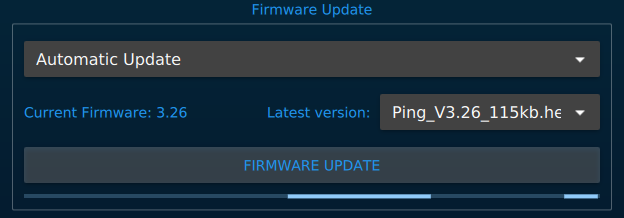
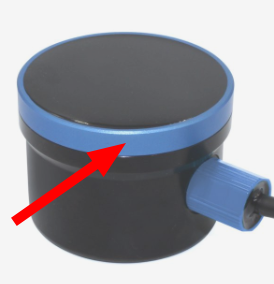
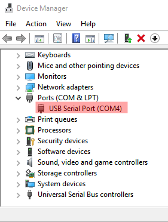

    

The Firmware Update menu allows you to update the programming on a Ping device.

Steps to flash the device:

1. [Connect](connection-settings.md) to the device
2. Open the Firmware Update menu
3. Choose 'Automatic Update', and the baudrate that you would like to use to communicate with the device (115kbps or 9600bps, if you are not sure choose 115kbps)
4. Click _FIRMWARE UPDATE_ to start the process.
5. The update progress is indicated by the progress bar located at the bottom of the menu. When the update completes, the progress bar will resume it's idle animation, and the Ping device will resume data transmission.

> Wait for the update process to complete before unplugging the device!

    

## Device recovery

If the device is not working after flashing a new firmware, or if some problem was encountered during installation, a recovery process may be necessary.

The device must be opened to restore the firmware. We only want to open the device if it's absolutely necessary, so to make sure, please [reset ping-viewer settings](https://docs.bluerobotics.com/ping-viewer/application-information/#header-buttons), and connect the device to the computer again. If ping-viewer detects the device automatically, there is no problem! If not, then we can proceed to recover the device.

To open the device, hold it firmly, and turn the blue ring in counterclockwise direction:

    

After the device is opened, turn it on and look for a blinking led on the circuit board inside of the device. If you see a blinking led, the device should be good and the firmware is running fine, you may close the device and double check the [troubleshooting instructions](http://docs.bluerobotics.com/ping-viewer/faq-and-troubleshooting/#troubleshooting).

If the led is not blinking:
 - Open the folder where the ping-viewer executable binary is located
 - Copy the folder path (we will use `/folder/path` in this example)
 - Open your OS terminal. (powershell on windows, what you prefer on linux :) )
 - type: `cd "/folder/path"`
 - After that you should download the last firmware available:
   - On windows: `Invoke-WebRequest -Uri "https://raw.githubusercontent.com/bluerobotics/ping-firmware/master/ping1d/Ping_V3.26_115kb.hex" -OutFile "$PWD/Ping_V3.26_115kb.hex"`
   - On mac/linux: `wget "https://raw.githubusercontent.com/bluerobotics/ping-firmware/master/ping1d/Ping_V3.26_115kb.hex"`
 - With the device open, you should see a BOOT button in the main board. Power down the device, press and hold this button down, then power the device and let go of the button
 - You should check the port of the device with windows **Device Manager** or with `dmesg` on linux.
 

    

 - After finding the port (`COMx` on windows and `/dev/ttyUSB*` on linux) you can start the flash procedure.
 - In the same terminal type:
   - On windows `.\stm32flash.exe -v -g 0x0 -b 115200 -w .\Ping_V3.26_115kb.hex COM4`
     - Where COM4 is my serial port
   - On linux `.\stm32flash -v -g 0x0 -b 115200 -w .\Ping_V3.26_115kb.hex /dev/ttyUSB0`
     - Where /dev/ttyUSB0 is my serial port

If the instructions are not clear or sound a bit complicated, please wait a bit more for us to create a Ping-Viewer version that allows you to recover devices.

TODO explain bootloader process
