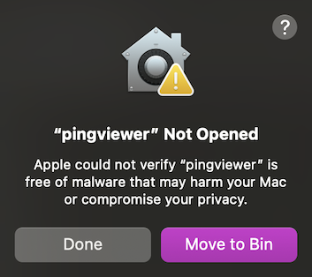

*Ping Viewer* Documentation
===========================

*Ping Viewer* is a graphical user interface for devices supporting the [*Ping* protocol](https://docs.bluerobotics.com/ping-protocol). The application allows you to connect, configure, view data, and record data from a *Ping* device.

## Supported Device Types

### Single-Direction Echosounders

- Requires the [*Ping1D* message set](https://docs.bluerobotics.com/ping-protocol/pingmessage-ping1d/)
- Estimates distance to an object or surface, for obstacle avoidance or surface/terrain tracking
- Moving the device creates a [waterfall](#waterfall) profile of the covered obstacles/terrain
- Known examples include:
    - Blue Robotics [*Ping Sonar* Altimeter and Echosounder](https://bluerobotics.com/store/sonars/echosounders/ping-sonar-r2-rp/)
        - [Open source firmware variant](https://github.com/bluerobotics/ping-firmware-oss/) available for reference
    - Cerulean Sonar [*Sounder S500*](https://ceruleansonar.com/product/sounder-s500/)

### Rotating Scanning Sonars

- Requires the [*Ping360* message set](https://docs.bluerobotics.com/ping-protocol/pingmessage-ping360/)
- Requesting different transducer angles builds up an image of objects in the space around the device
- Can compensate for vehicle heading, if mounted on a MAVLink-enabled vehicle
- Known examples include:
    - Blue Robotics [*Ping360* Scanning Imaging Sonar](https://bluerobotics.com/store/sonars/imaging-sonars/ping360-sonar-r1-rp/)

## Installing and Running the Application

Follow the setup instructions for your operating system:

- [Windows](https://docs.bluerobotics.com/ping-viewer/#windows)
- [Mac](https://docs.bluerobotics.com/ping-viewer/#mac)
- [Linux](https://docs.bluerobotics.com/ping-viewer/#linux)

### Windows

Download [this .zip file](https://github.com/bluerobotics/ping-viewer/releases/latest/download/pingviewer-Release.zip), open the download location in the File Explorer, and extract it. Open the application by double clicking the executable file (pingviewer.exe). Windows will ask you to trust the software; click **More Info** → **Run Anyway**.

### Mac

Download [this .dmg file](https://github.com/bluerobotics/ping-viewer/releases/latest/download/pingviewer-Release.dmg), and double click it to open. Drag the Ping Viewer application icon to your *Applications* folder. Open the application by double clicking the icon in your *Applications* folder.

If you get an 'unidentified developer' notification when you try to open the application, you may need to adjust your security preferences to allow the application to run. Visit **System Preferences** -> **Privacy and Security**, scroll to the bottom, click 'Open Anyway', and enter your password when prompted.

### Linux

Download [this .AppImage file](https://github.com/bluerobotics/ping-viewer/releases/latest/download/pingviewer-Release.AppImage). Edit the permissions of the .AppImage to have _executable_ permission with the command line: `chmod +x ping-viewer-linux.AppImage`. Open the AppImage by double clicking it, or execute it from the command line: `./ping-viewer-linux.AppImage`.

> Remember to run the commands in the same path where the Appimage file is.

## Connection Setup

To begin using the device, connect it to a USB - UART converter that operates on 5V like [this](https://www.bluerobotics.com/store/comm-control-power/tether-interface/bluart-r1-rp/) Blue Robotics adapter. Then connect the converter to your computer's USB port. The Ping Viewer application should automatically detect your device and begin displaying data. If it does not, check the [FAQ and Troubleshooting](faq-and-troubleshooting.md) guide.

Visit the [Device Manager](device-manager.md) menu for more connection options.

## Main Application Interface

### Ping1D

When using a Ping1D device, the Ping Viewer window consists of four important components:

1. [Distance Readout](#distance-readout)
2. [Distance Axis](#distance-axis)
3. [Return Plot](#return-plot)
4. [Waterfall](#waterfall)

#### Distance Readout

The Distance Readout displays the distance to the target in the most recent measurement. This is the distance to the seafloor in [depth sounding](https://en.wikipedia.org/wiki/Depth_sounding) applications.

The confidence measurement for the most recent sample is displayed below the distance in the Distance readout. The color of the Distance Readout reflects the current confidence measurement, where green = 100%, yellow = 50% and red = 0%: 

The size of the distance readout can be [moved and adjusted](hotkeys-and-shortcuts.md#mouse-shortcuts).

#### Distance Axis

The Distance Axis is labeled with bold numbers on the right-hand edge of the Waterfall. This axis represents the distance from the Ping device transducer. The axis runs vertically down the screen, with the face of the transducer (zero distance) located at the top of the window. The deeper/farther an object is from the transducer, the closer its return will appear to the bottom of the window. The Distance Axis scale automatically adjusts to display the current scanning range of the Ping device.

There is an orange arrow on the Distance Axis indicating the distance to the target in the most recent measurement (this is the same as the Distance Readout).

#### Return Plot

The Return Plot displays the return strength vs distance of the most recent profile sample. The plot displays the measurement of only a single dependent variable (return strength), and is simply mirrored for ease of viewing. Stronger returns appear as wider traces.

**Note** You may observe a very strong return at the top of the screen (at zero distance, essentially touching the device); this return is from the Ping device itself. When the Ping device emits the acoustic pulse, the device is still vibrating or 'ringing' like a bell when it begins measuring the return signal. This residual energy in the vibrations of the Ping device body is picked up as a return signal until it decays away.

#### Waterfall

The Waterfall is a three dimensional plot that occupies the main portion of the application window. The Waterfall plots consecutive profile samples (distance running vertically and color indicating signal strength). The horizontal axis is time; new data is displayed on the right edge of the Waterfall as older data moves to the left.

The color scheme (gradient) of the Waterfall can be [customized](display-settings.md).

### Ping360

For the Ping360, there is no distance readout, the waterfall is wrapped around into a circular (polar) plot showing the scan data at each angle, and the distance axis is along the right-hand edge of the sector scan. The return plot is the same as for the Ping1D, and shows the signal return strength over the full range of the latest ping.

The sector angle and range [can be set](device-settings-ping360.md) to match your operating requirements, and there are options for [heading integration and head down mode](display-settings.md) to adapt the display to your ROV and Ping360's orientation.

## Application and Device Settings

See [here](display-settings.md) for instructions to switch between meters and feet for the application display.

To adjust the update rate and other Ping device settings, visit the relevant page in the 'Device Settings' section.
